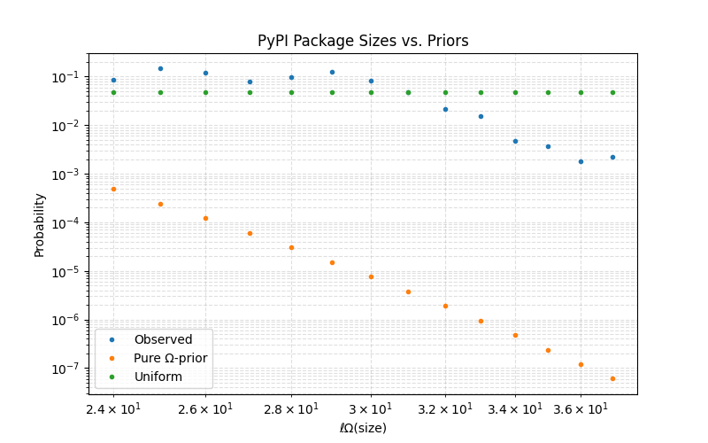
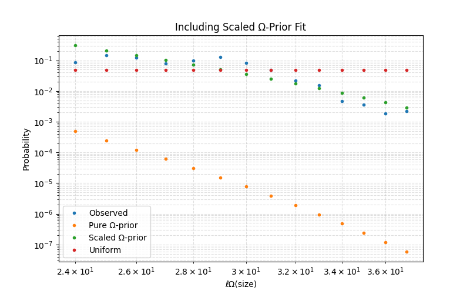

# Multiplicative Turing Ensembles, Pareto's Law, and Creativity

## Installation

Clone the repository:
```bash
git clone https://github.com/yourusername/mte-pareto.git
cd mte-pareto
```

Install dependencies:
```bash
pip install requests numpy matplotlib
```

## Usage

### PyPI Analysis
Analyzes package sizes from the top PyPI packages:
```bash
python pypi_analysis.py
```

### Debian Analysis
Analyzes package sizes from Debian stable repository:
```bash
python debian_analysis.py
```

## Results

Below we can see an empirical comparison between the actual PyPI package lengths distribution, the Gibbs prior (with self-delimiting Elias' length), and the uniform baseline (left). The rescaled Gibbs prior matches the empirical distribution quite closely (right). These two figures are output by `pypi_analysis.py`

<div align="center">
<table>
<tr>
<td></td>
<td></td>
</tr>
</table>
</div>
