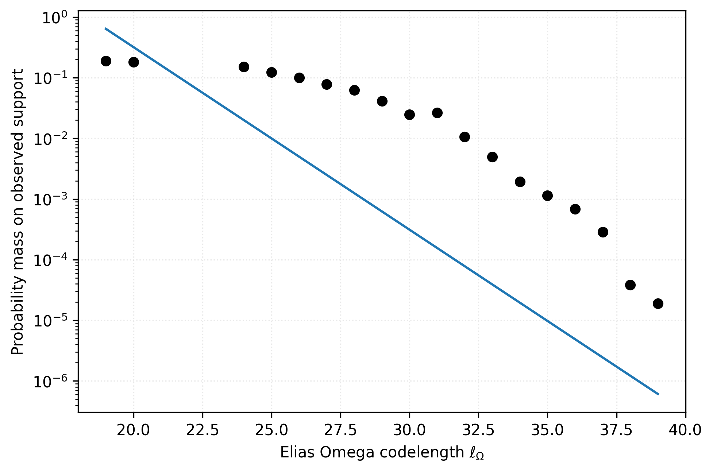
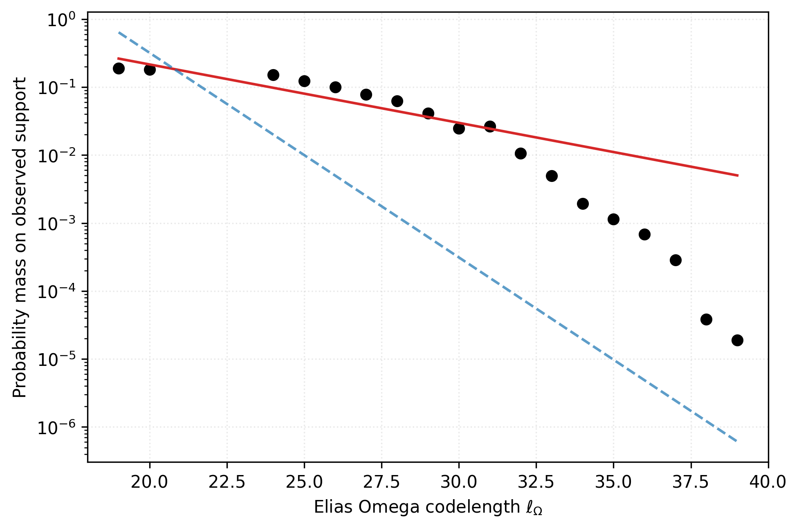
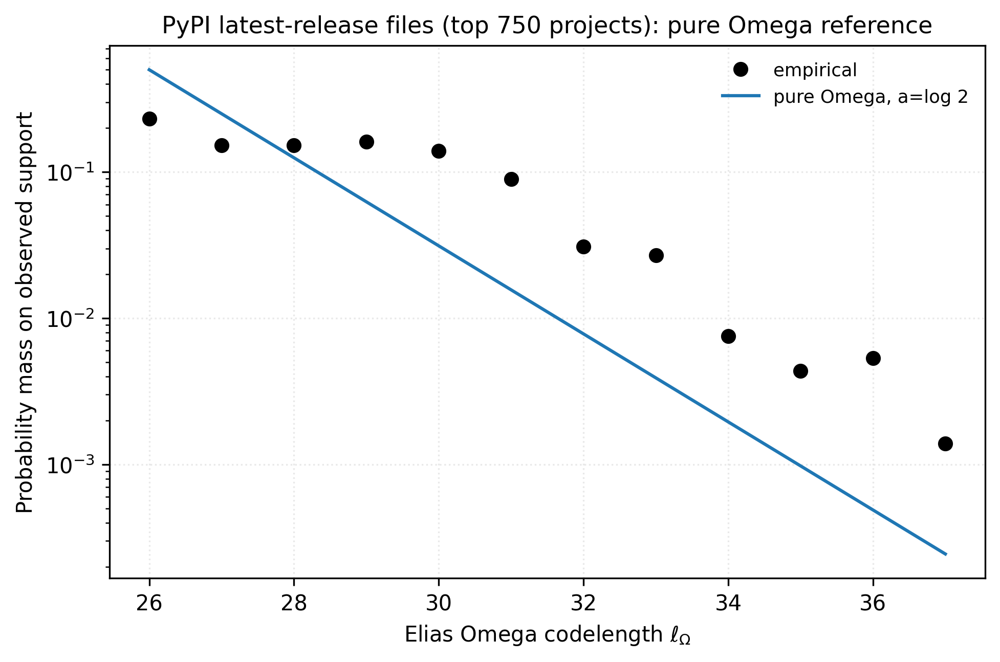
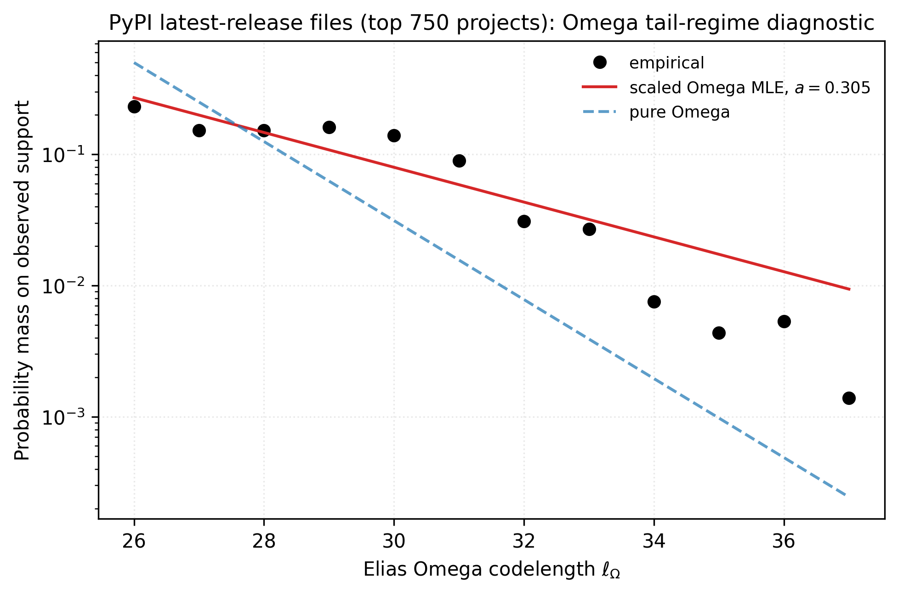
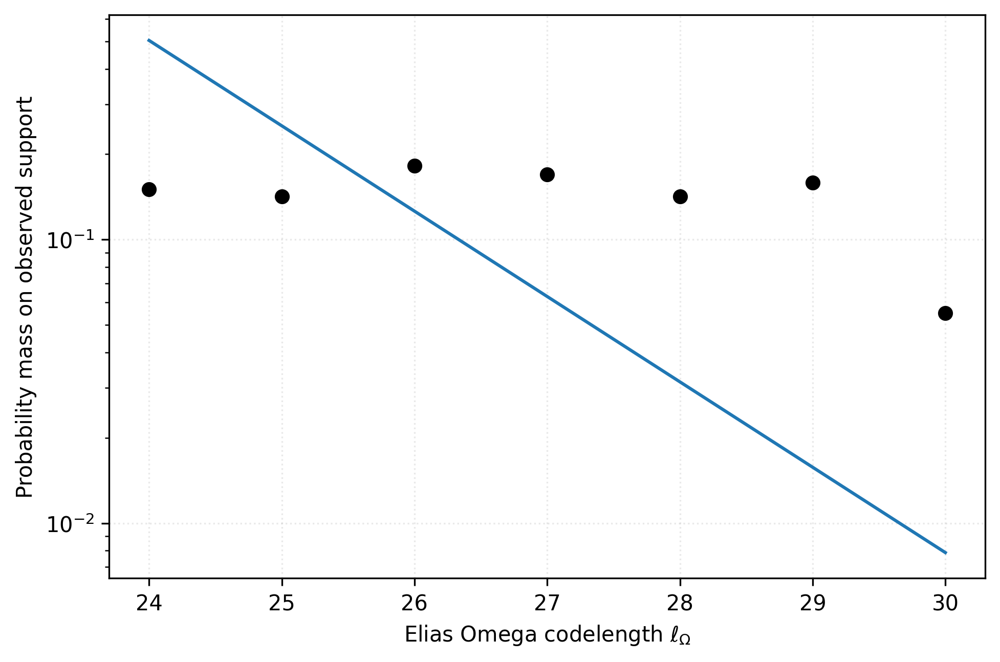
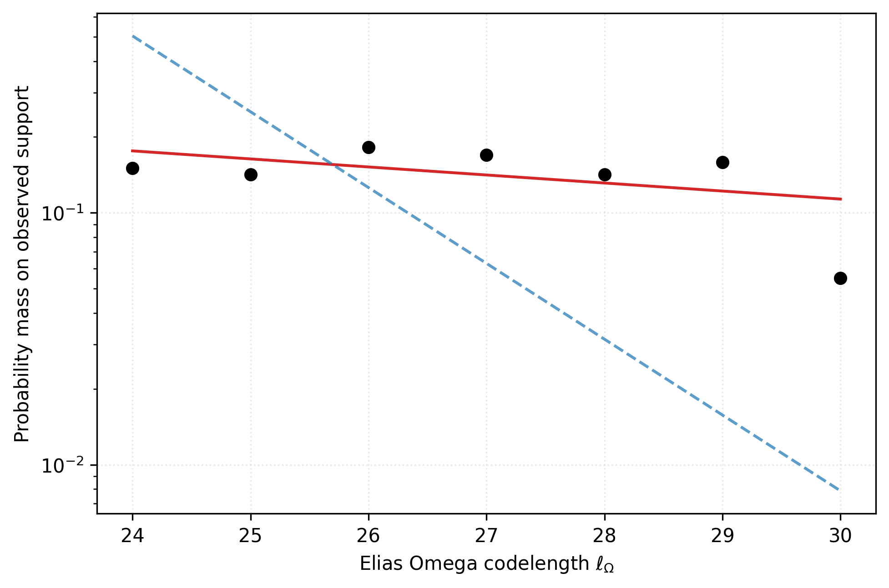

# Multiplicative Turing Ensembles, Pareto's Law, and Creativity

Empirical support code for the manuscript. The scripts fetch software-size
datasets, convert byte sizes to Elias Omega codelengths, and run a compact
finite-support diagnostic for the resulting codelength histograms.

## Installation

```bash
git clone https://github.com/sashakolpakov/mte-pareto.git
cd mte-pareto
python -m pip install numpy matplotlib
```

## Revised Analysis

The scaled Omega model is now fit by multinomial likelihood on the observed
codelength support:

```text
q_a(ell) = exp(-a ell) / sum_{ell in support} exp(-a ell)
```

The normalizing constant is determined by the support, so there is no separate
free intercept. Each run reports KL divergence and log-likelihood for the pure
Omega slope `a = log 2` and the fitted scaled-Omega slope. It also reports
bootstrap confidence intervals for the fitted slope and KL.

The empirical target is deliberately narrow: `a < log 2` is evidence for a
heavier-than-pure-Omega tail inside the Omega energy scale. These scripts are
targeted validation of that diagnostic, not a search for the best distributional
model of Debian or PyPI file sizes.
Use additional datasets to test whether the same Omega-tail diagnostic recurs,
not to run a broad competitor sweep.

## Figures

The repository includes the generated diagnostic figures. In each row, the left
panel compares the empirical codelength histogram with the pure Omega reference;
the right panel compares it with the fitted scaled-Omega model.

<div align="center">
<table>
<tr>
<th>Dataset</th>
<th>Pure Omega reference</th>
<th>Fitted scaled Omega</th>
<th>Key</th>
</tr>
<tr>
<td>Debian binary packages</td>
<td></td>
<td></td>
<td>black points: empirical<br/>blue solid/dashed: pure Omega<br/>red solid: fitted scaled Omega</td>
</tr>
<tr>
<td>PyPI latest-release files</td>
<td></td>
<td></td>
<td>black points: empirical<br/>blue solid/dashed: pure Omega<br/>red solid: fitted scaled Omega</td>
</tr>
<tr>
<td>CRAN source archives</td>
<td></td>
<td></td>
<td>black points: empirical<br/>blue solid/dashed: pure Omega<br/>red solid: fitted scaled Omega</td>
</tr>
</table>
</div>

Latest full pipeline run:

| Dataset | Analysis n | fitted a (95% CI) | KL pure | KL scaled |
| --- | ---: | ---: | ---: | ---: |
| Debian binary packages | 52,399 | 0.1979 [0.1965, 0.1993] | 1.6066 | 0.0998 |
| PyPI latest-release files | 5,093 | 0.3047 [0.2963, 0.3135] | 0.4226 | 0.0734 |
| CRAN source archives | 472 | 0.0734 [0.0339, 0.1168] | 0.6598 | 0.0330 |

## Usage

### PyPI Latest-Release File Sizes

Fetch the top PyPI projects and analyze latest-release distribution files:

```bash
python pypi_analysis.py --max-packages 750 --bootstrap 1000 --sizes-csv pypi_file_sizes.csv
```

Use cached sizes for a deterministic rerun:

```bash
python pypi_analysis.py --use-sizes-csv --sizes-csv pypi_file_sizes.csv --bootstrap 1000
```

### Debian Binary Package Sizes

This reproduces the manuscript's Debian `.deb` package-size analysis:

```bash
python debian_analysis.py --dataset binary --suite stable --component main --arch amd64 --bootstrap 1000
```

Use cached sizes:

```bash
python debian_analysis.py --dataset binary --use-sizes-csv --sizes-csv debian_binary_package_sizes.csv --bootstrap 1000
```

### Debian Source File Sizes

This is an additional socio-technical software-size dataset from Debian
`Sources` indices:

```bash
python debian_analysis.py --dataset source --file-kind all --output-prefix debian_source --bootstrap 1000
```

`--file-kind archives` excludes `.dsc` control files; `--file-kind dsc` keeps
only source-control files.

### CRAN Source Package Sizes

Fetch a deterministic sample of CRAN source package archives using the CRAN
package index and HTTP content lengths:

```bash
python cran_analysis.py --max-packages 750 --bootstrap 1000 --sizes-csv cran_source_archive_sizes.csv
```

Use cached sizes:

```bash
python cran_analysis.py --use-sizes-csv --sizes-csv cran_source_archive_sizes.csv --bootstrap 1000
```

## Outputs

Each run prints an Omega-tail diagnostic table and writes:

- `<prefix>_model_metrics.csv`
- `<prefix>_sizes_priors.png`
- `<prefix>_sizes_prior_scaled.png`
- an optional raw size cache if `--sizes-csv` is supplied

Figures are saved deterministically. Add `--show` to display them interactively.
